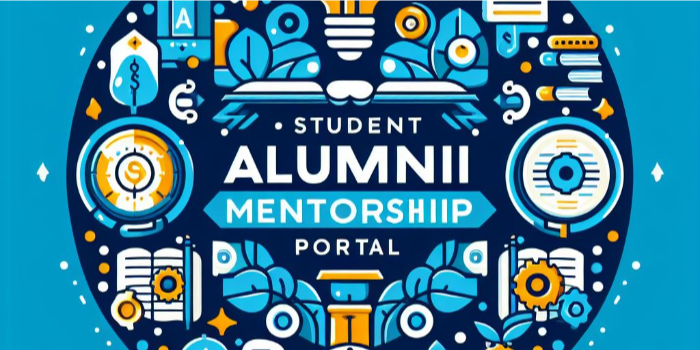

# Student Alumni Mentorship Portal

:star:**Please star the repository if you happen to like the project**

The Student Alumni Mentorship Portal is a web-based platform designed to foster meaningful connections between current students and alumni of IIIT Delhi. This software facilitates mentorship relationships, enabling students to seek guidance, share experiences, and build professional networks with alumni mentors.

## Table of Contents

- [Introduction](#introduction)
- [Features](#features)
- [Architecture & Technology Stack](#architecture--technology-stack)
- [Installation](#installation)
- [Usage](#usage)
- [Contributing](#contributing)
- [Authors](#authors)
- [License](#license)

## Introduction

The Student Alumni Mentorship Software, sponsored by IIIT Delhi's Alumni Affairs Office, aims to bridge the gap between current students and alumni. Through this platform, students can connect with alumni mentors, schedule meetings, engage in private chats, and seek guidance for their academic and professional growth.

## Features

### For Students

- **Registration**: Sign up to access the mentorship platform.
- **View Profiles**: Explore and filter alumni mentors based on specific criteria.
- **Chat & Meetings**: Initiate private conversations, schedule virtual meetings with mentors.
- **Feedback & Reporting**: Report issues and provide feedback on mentor interactions.

### For Alumni

- **Profile Management**: Update job profiles, respond to student chat messages.
- **Meeting Scheduling**: Provide availability for meetings, manage scheduled meetings.
- **Feedback & Blocking**: Report students, manage communication by blocking if needed.

### For Admin

- **User Management**: Manage profiles, engage in private chats, handle complaints.
- **Notifications**: Receive alerts for actions taken by alumni and students.

## Architecture & Technology Stack

### Front End

- **Technology**: React.js
- **Component Library**: Material-UI
- **Google Calendar API**: Google Cloud Console & Supabase
- **Authentication**: Auth0

### Back End

- **Framework**: Node.js with Express.js
- **Database**: MongoDB
- **Authentication**: Auth0
- **API Documentation**: OpenAPI

### Deployment

- **Continuous Integration/Deployment**: CI/CD pipelines for seamless integration and deployment.
- **Scalability & Performance**: Utilizes MERN stack for scalability and real-time features.

## Installation

1. **Clone Repository**: `git clone https://github.com/Sarthak-100/Student-Alumni-Mentorship-Portal.git`
2. **Install Dependencies**:
   - Frontend: `cd frontend && npm install` (use `npm install -force` if former command doesn't work)
   - Backend: `cd backend && npm install`
3. **Configuration**:
   - Set up environment variables for Auth0, MongoDB, etc.
4. **Start Application**:
   - Frontend: `cd frontend && npm start`
   - Backend: `cd backend && npm run dev`

## Usage

1. **Register/Login**: Create an account or log in using existing credentials.
2. **Explore Mentors**: Browse alumni profiles, filter based on preferences.
3. **Initiate Chat/Meetings**: Start conversations, schedule meetings with mentors.
4. **Admin Panel**: Manage user profiles, handle complaints, and engage in chats.

## Contributing

Contributions are welcome! Please follow the [coding standards](docs/Coding%20Standards%20Document.pdf) and create pull requests for any enhancements or bug fixes.

## Authors

- [Abhit Rana](https://github.com/abhit-rana)
- [Harshit Jain](https://github.com/HarshitJain-1908)
- [Sarthak Maini](https://github.com/Sarthak-10/)

## License

This project is licensed under the [MIT License](LICENSE).

